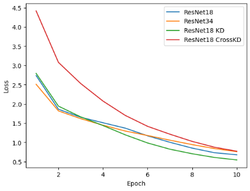
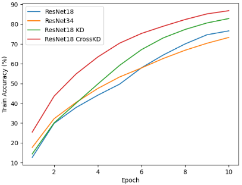
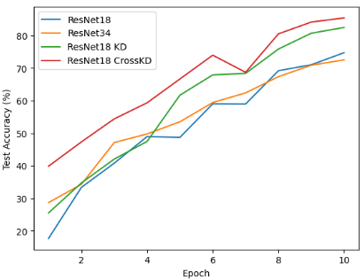
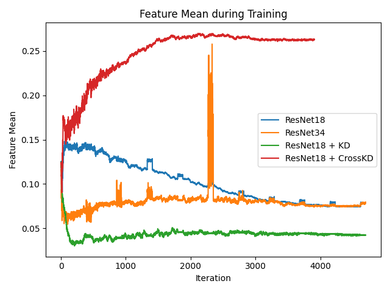
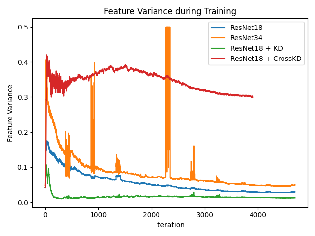

# CIFAR-10 における forward hook を用いた、知識蒸留

## 概要

本実験では **ImageNet 事前学習済み ResNet** を用い、CIFAR-10 において以下を比較した。

* 通常学習（ResNet18 / ResNet34）
* 特徴量ベースの Knowledge Distillation（KD）
* **Cross-Head Knowledge Distillation（CrossKD）**

特に **ResNet34 → ResNet18** の蒸留設定において、CrossKD が学習効率・最終精度の両面で大きな改善を示すことを確認した。


## 実験設定

* Dataset: CIFAR-10
* Backbone: ResNet18 / ResNet34
* Pretraining: ImageNet
* Optimizer / LR: 
* Epochs: 10

## 実行方法
```bash
sh/train_all.sh
```

## 実験結果


### Test Accuracy

| Model        | Learning Type | Teacher      | Epochs | Test Accuracy |
| ------------ | ------------- | ------------ | ------ | ------------- |
| ResNet18     | 通常学習          | -            | 10     | ~74.75%       |
| ResNet34     | 通常学習          | -            | 10     | ~72.55%       |
| ResNet18     | Feature KD    | ResNet34     | 10     | ~82.50%       |
| **ResNet18** | **CrossKD**   | **ResNet34** | **10** | **~85.44%**   |



 

### Analysis

CrossKD時の、生徒モデルの特徴量の統計を可視化した

 

通常 KDは、特徴量の分散を下げる方向に働くが、CrossKDは特徴量の分散を上げる方向に働く。

## 考察

* CrossKD は

  * feature alignment
  * head 間の知識伝播
    を同時に促進している可能性が高い

* 通常 KD よりも

  * 収束が速い
  * 最終性能が高い

* 軽量モデル（ResNet18）の性能底上げに非常に有効


## 今後の課題

* epoch 数を増やした場合の最終性能
* 他アーキテクチャ（ViT, MobileNet 等）への適用
* CrossKD の損失重み・アラインメント位置のアブレーション
* 特徴量の蒸留とCrossKD知識蒸留を両方同時に行う
* Mmrazor をベースに、ATSS のCrossKDなどを実装できるか？


## まとめ

**CrossKD は CIFAR-10 + ImageNet 事前学習環境において**

* 学習速度
* 学習安定性
* 最終 Test Accuracy

のすべてで通常学習・通常 KD を上回る結果を示した。
